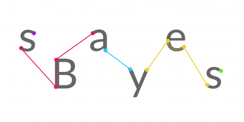
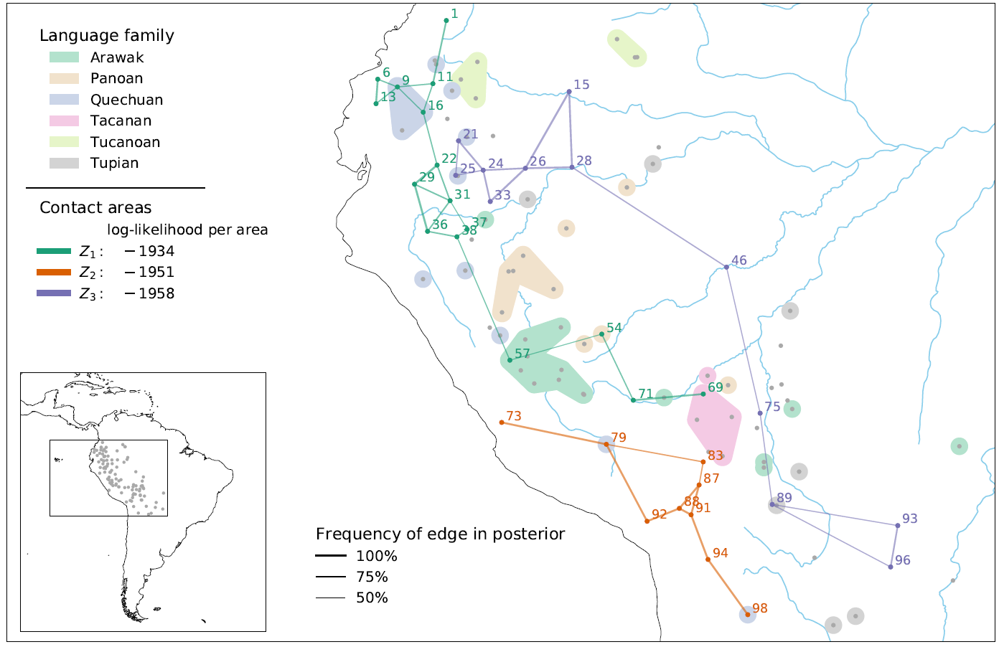
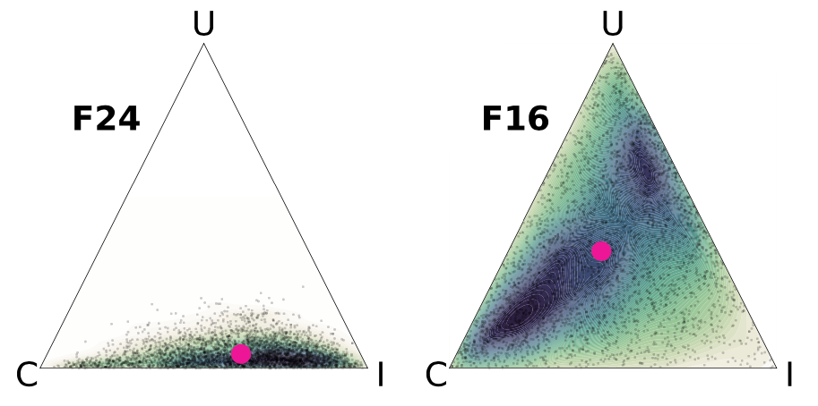

<p align="center">
  
  <br>
  <b>USER MANUAL</b>
  <br><br>
  <i>Peter Ranacher, Nico Neureiter, Natalia Chousou-Polydouri, Olga Sozinova</i>
  <br><br>
</p>

# Introduction

This document explains how to use `sBayes` - a software package for
finding areas of language contact in space, based on linguistic
features. Contact areas comprise geographically proximate languages,
which are similar and whose similarity cannot be explained by the
confounding effect of universal preference and inheritance. For more
details, see [the original
publication](https://royalsocietypublishing.org/doi/10.1098/rsif.2020.1031).
A typical analysis in `sBayes` consists of five steps:

1.  Data coding and preparing the features file

2.  Defining the model and the priors

3.  Setting up and running the MCMC

4.  Summarizing and visualizing the posterior sample

Each of the steps above will be covered in detail in the following
sections of the manual. `sBayes` can also be used for simulation of
linguistic areas and linguistic families. Simulations will be covered in
the last section of the manual.

## How to install `sBayes`

In order to install `sBayes`, you need to have Python (3.8 or later) on your computer.
You can check what version of python you have by opening a terminal and
typing `python`. Then you can install `sBayes`. The exact steps to do
this depend on your operating system (due to different ways of
installing dependencies). Following are the instructions for Linux,
MacOS and Windows.

### Linux (Debian/Ubuntu)

To install `sBayes`, open a terminal window, navigate to the folder
where you want to install it and follow these steps:

1.  Get the `sBayes` source code by running:\
    ` git clone https://github.com/derpetermann/sBayes`\
    This will create a `sBayes` directory on your computer.

2.  Navigate to this new directory by running `cd sBayes`.

3.  Install GEOS, GDAL and PROJ by running:\
    ` sudo apt-get install -y libproj-dev proj-data proj-bin libgeos-dev`

4.  Install `sBayes` along with some required python libraries by
    running `pip install .`

### MacOS

On MacOS we recommend using homebrew to install the required system
packages. Open a terminal window, navigate to the folder where you want
to install `sBayes` and follow these steps:

1.  Get the `sBayes` source code by running:\
    ` git clone https://github.com/derpetermann/sBayes`\
    This will create a `sBayes` directory on your computer.

2.  Navigate to this new directory by running `cd sBayes`.

3.  Install GEOS, GDAL and PROJ by running `brew install proj geos gdal`

4.  Install `sBayes` along with some required python libraries by
    running `pip install .`

If you have Apple Silicon, it is possible that you ran into problems with homebrew installing GEOS and GDAL.
In this case, install [MacPorts](https://www.macports.org/) and run:

`sudo port install proj geos gdal` 

in step 3 instead.

### Windows

On Windows we recommend using [Anaconda](https://www.anaconda.com/) to
install the required packages. To do this, download Anaconda, open an Anaconda terminal window, navigate
to the folder where you want to install `sBayes` and follow these steps:

1.  Get the `sBayes` source code by running:\
    ` git clone https://github.com/derpetermann/sBayes`\
    This will create a `sBayes` directory on your computer.

2.  Navigate to this new directory by running `cd sBayes`.

3.  Install GEOS, GDAL and PROJ manually or using the OSGeo4W installer
    <https://trac.osgeo.org/osgeo4w>.

4.  Install `sBayes` along with some required python libraries by
    running `pip install .`

# Data coding

`sBayes` receives as input a matrix of discrete categorical data in the
format of a CSV file. The precise structure of the features.csv file
will be covered below.

## Preparing the data

The data for `sBayes` consist of a number of features, each with a
number of *states*. Each feature is a linguistic property presumed
relevant for the discovery of areas and should be logically independent
from other features (i.e. there shouldn't be a common causal mechanism
linking the two features). For example, treating a /p/-/b/ contrast, a
/t/-/d/ contrast and a /k/-/g/ contrast as three independent features is
tripling what arguably is a single voiceless-voiced stop contrast. Using
logically dependent features or strongly correlated features results in
an inflation of confidence, as it is essentially counting multiple times
the same underlying feature).

Each feature has a number of mutually exclusive discrete states.
Features can be binary or multistate. It should be noted that every
state is considered as potentially contributing to a linguistic area,
and therefore all states should be \"informative\" or forming a
\"natural\" class. For example, a feature about vowel inventory size
with two states: \"three vowels\" and \"not three vowels\" is
problematic, because the state \"not three vowels\" is a non-informative
state. There are multiple ways of not having an inventory of three
vowels and there is no good argument that three-vowel inventories spread
and are inherited, while all other vowel inventories are similar enough
and could have come about through inheritance or contact irrespective of
the number of their vowels. An alternative in this case would be to have
a state for every observed number of vowels in an inventory. In general,
states based on the negation of another state and absent states are
usual suspects for being non-informative and should be examined in
detail.

## The *features.csv* file

The `features.csv` has the following structure:

| Columns | | Description |
| --- | --- |--- | 
| *id* | required | a unique identifier for each language |
| *name* | required | a name for each language |
| *x* | required | the spatial x-coordinate of the language |
| *y* | required | the spatial y-coordinate of the language |
| *family* | | the name of a family or sub-clade of a family |
| \<*F1*\> | | feature 1 |
| \<*F2*\> | | feature 2 |
| *...* | | *...* | 
                        
Columns in `features.csv`

<*F1*>, <*F2*>, ... are placeholders for feature names, e.g.
*vowel_inventory_size*. Feature names must be unique. Distinct entries
in each feature column are treated as distinct categorical states of the
feature, i.e. "1", "2", "two" and "2.0" in *vowel_inventory_size* are
interpreted as four distinct categories (four different inventory
sizes). To avoid potential mix-ups and assignments to nonexistent
states, users can provide all applicable states of any given feature in
the `feature_states.csv` file (see below). A blank space in the CSV --
leaving a cell empty -- is interpreted as NA.

Geographically, languages are represented by a point location, e.g.
their centre of gravity. Coordinates $x$ and $y$ uniquely define the
location of a language, either as latitude and longitude in a spherical
coordinate reference system (CRS), or projected to a plane, for example,
the Universal Transverse Mercator CRS. If spherical CRS is used, $x$
corresponds to the longitude and $y$ to the latitude. We are not
surveyors, after all.

`sBayes` models inheritance per distinct entry in the column *family*.
Languages with the same entry for *family* are assumed to belong to a
common family (or sub-clade of a family). If left empty, inheritance is
not modelled for this language.

Table [2](#features_example) shows an example of a
`features.csv`-file.
Table [3](#features_states) gives the applicable states for the
three features in Table [2](#features-example): person affixes for possession
(*pers_aff*) are either *Y* (present) or *N* (absent), participant roles
marked on verb (*role_mark*) can take states *A* (A marking), *B* (P
marking), *c* (both A and P marking), *D* (either A or P marking), or
*E* (neither A nor P marking), and phonemic oral-nasal contrast for
vowels (*vow_con*) is *Y* (present) or *N* (absent).

#### Table: Example of `features.csv`
<a name="features-example"></a>

| **id** | **name**  | **x**            | **y**            | **family** | **pers_aff** | **role_mark** | **vow_con** |
|--------|-----------|------------------|------------------|------------|--------------|---------------|-------------|
| des    | Desano    | -1092883.205     | 3570461.932      | Tucanoan   | N            | A             | Y           |
| tuo    | Tucano    | -1102073.299     | 3569861.124      | Tucanoan   | N            | A             | Y           |
| cot    | Caquinte  | -1423618.645     | 2206737.923      | Arawak     | Y            | C             | N           |
| ...    |           |                  |                  |            |              |               |             |


#### Table: All applicable states in the corresponding `feature_states.csv`
<a name="features-states"></a>

| **pers_aff** | **role_mark** | **vow_con** |
|--------|--------|--------|
| N      | A      | N      |
| Y      | B      | Y      |
|        | C      |        |
|        | D      |        |
|        | E      |        |


# Model parameters

`sBayes` aims to predict why language $l$ has feature $f$ with state
$s$, e.g. why retroflex affricates ($f$) are present ($s$) in the
Arawakan language Chamicuro ($l$). `sBayes` proposes three explanations
-- the feature is universally preferred, has been inherited in the
family or adopted through contact. Similarities due to universal
preference and inheritance are treated as confounding effects, while the
remaining similarities are attributed to contact: `sBayes` proposes
myriads of different areas, testing whether languages in these areas
areas are similar and whether these similarities can be explained by
confounding. `sBayes`infers one categorical distribution for universal
preference, inheritance in each family, an contact in each area per
feature $f$. All model parameters are passed to `sBayes` in a separate
configuration file (see, section about the *config.JSON* file).

## Confounding effects

`sBayes` infers the assignment of languages to contact areas from
similarities in the data that are poorly explained by the confounding
effects. Universal preference is always modelled as a confounder, while
the effect of inheritance can be turned on or off by the analyst (the
default is on). If inheritance is modelled as a confounder, languages
must be assigned to families (or sub-families) in `features.csv`.

## Number of areas

The number of contact areas $K$ defines how many distinct areal
groupings are assumed in the data. We suggest to run the algorithm with
$K=1$, increase $K$ iteratively, and evaluate the posterior evidence of
each model in post-processing, for example using the deviance
information criterion (DIC).

# Priors <a name="sec:priors"></a>

The following parameters in `sBayes` require a prior distribution:

-   universal preference, inheritance (preference in each family) and
    contact (preference in each area) per feature

-   weights per feature

-   spatial allocation of an area, i.e. the geo-prior

-   size of an area

The prior for universal preference and inheritance and the geo-prior can
be informed from empirical data. In what follows we introduce the prior
for each parameter.

## Universal preference, inheritance, and contact

The prior for universal preference ($\alpha_f$) expresses our knowledge
about the global preference of a state before seeing the data. Similar,
the prior for inheritance ($\beta_{f, \phi}$) expresses our knowledge
about the preference of a state in a language family, for example
Arawak. Both priors can be uniform -- each state is equally probable
a-priori -- or reflect empirical knowledge about language: some states
might be more common, because they are essential for communication,
easily processed in our brains or inherited in a family. Languages will
be be more likely to share these states, which requires a re-tuning of
the confounding effect. `sBayes` models the prior for universal
preference with a Dirichlet distribution:

$$
\begin{aligned}
P(\alpha_f) = \textrm{Dir}(\psi_i) \quad \textrm{for } i \in 1, \ldots, N_f,
\end{aligned}
$$


where $N_f$ is the number of states for feature $f$ and $\psi_i$ is the
concentration parameter for state $i$.

In contrast to universal preference and preference in a family,
preference in an area is unknown a priori: contact areas and the
features defining them are the result of an analysis with `sBayes`
rather than a premise. Thus, the prior for preference in an area is
necessarily \"uniform\".

## Weights

The prior on weights ($w_f$) is uniform, i.e. a priori universal
preference, inheritance and contact are equally likely:

$$ P(w_f) = \textrm{Dir}(\psi_1=1, \psi_2=1, \psi_3=1) $$


## The geo-prior

The geo-prior models the *a priori* probability of languages to be in
contact, given their spatial locations. A *uniform* geo-prior assumes
all areas to be equally likely, irrespective of their location in space.
The *cost-based* geo-prior builds on the assumption that geographically
proximate languages are more likely to be in contact than distant ones.
Distance is modelled as a cost function $C$, which assigns a
non-negative value $c_{i,j}$ to each pair of locations $i$ and $j$. By
default costs are expressed as Euclidean distance (for planar
coordinates) or the great-circle distance (for spherical coordinates).

Alternatively, users can provide a cost matrix to quantify the effort to
traverse geographical space (e.g. in terms of hiking effort, travel
times, \...). Since costs are used to delineate contact areas, they are
assumed to be symmetric, hence $c_{i,j} = c_{j,i}$. For cost matrices
where this is not immediately satisfied (such as hiking effort), the
costs are made symmetric, e.g. by averaging the entries for $c_{i,j}$
and $c_{j,i}$ in the cost matrix. The cost matrix has the following
structure:

#### Table: Columns in `cost_matrix.csv`
<a name="cost_matrix_columns"></a>

| **Column**       | **Description**                        |
|------------------|----------------------------------------|
| *language*       | a unique identifier for each language  |
| <*language 1*>   | distances to language 1                |
| <*language 2*>   | distances to language 2                |
| *...*            |                                        |

<*language 1*>, <*language 2*> are placeholder for the unique
identifiers of language 1 and 2. The element $(i,j)$ in the CSV gives
the costs to travel from entity $i$ to entity $j$. The cost matrix has a
trace of zero, i.e. the distance of each entity to itself is zero. The
matrix is not necessarily symmetric. The costs $(i,j)$ might differ from
the costs $(j,i)$. The [table below](#cost_matrix) shows an example of a cost matrix, again
corresponding to data in `features.csv`.

#### Table: Example of `cost_matrix.csv`
<a name="cost_matrix"></a>

| **id** | **des** | **tuo** | **trn** |
|--------|---------|---------|---------|
| des    | 0       | 100     | 40      |
| tuo    | 100     | 0       | 15      |
| trn    | 40      | 15      | 0       |


## Size of an area

In addition to the geo-prior, there is an implicit prior probability on
$|Z|$, the number of languages in an area $Z \in \mathcal{Z}$. `sBayes`
employs two types of priors for $|Z|$. The *uniform area prior* assumes
that each area is equally likely a-priori. This puts an implicit prior
on size, such that larger $|Z|$ are preferred over smaller ones: there
are $(M-m+1)/m$ more ways to choose $m$ objects from a population $M$
than $m-1$ objects, given $m \leq M/2$. The *uniform size prior* assumes
that all $|Z|$ are equally likely a-priori, i.e. $P(|Z|)$ has a uniform
prior in the interval $[min(|Z|), max(|Z|)]$.

# MCMC and diagnostics

`sBayes` adopts a Markov Chain Monte Carlo (MCMC) approach to sample
from the posterior distribution of a model. In the warm-up phase,
multiple independent chains explore the parameter space in parallel.
After warm-up, `sBayes` moves to the chain with the highest likelihood,
from where it starts to sample from the posterior. Users can tune both
the warm-up and the actual sampling.

## Warm-up

For the warm-up, users can define the number of steps and the number of
chains to explore the parameter space. Each sampler starts from a random
initial location. More steps and more chains increase the chances that
the warm-up reaches a high density region from where the actual sampling
can take over, but at the same time result in a longer run time. The
number of steps and chains depends on the complexity of the model, the
number of languages, features, families and areas. If the number of
iterations and chains are not provided by the user, `sBayes` falls back
on default values. These might not be appropriate for complex models. We
also recommend to run the algorithm several times (e.g. five) and
compare the posterior distribution across runs. Together with the
warm-up, this lowers the possibility that an unfortunate starting
location has an influence on the posterior sample.

## Sampling from the posterior

For the actual sampling, the users can set the number of steps in the
Markov chain, the sample size and the operators used in the MCMC. The
number of steps depends on the complexity of the model. Caution: If not
defined, `sBayes` uses default values, which might not be appropriate
for complex models. The sample size defines the number of posterior
samples that are returned to the user. In an MCMC, consecutive steps in
the chain are necessarily auto-correlated. Only sufficient iterations
and an appropriate ratio between samples and steps guarantees that
consecutive samples in the posterior are uncorrelated. We discuss below
how to estimate the effective sample size (ESS), the number
uncorrelated, independent samples in the posterior.

The user can define how the MCMC proposes new samples, which operators
are used and how often each operator is called. `sBayes` employs spatial
operators to propose new areas -- to add, remove or swap languages in an
area -- and a Dirichlet proposal distributions to propose new weights
and estimates for universal preference, inheritance and contact per
feature. For the Dirichlet proposal distribution, the user can define
the precision of each proposal step, i.e. how far away from the current
sample are new candidates recruited. While a high precision ensures that
the parameter space is explored exhaustively, it also makes sampling
more ineffective: `sBayes` needs more iterations to collect sufficient
independent samples.

An analysis in `sBayes` returns the following output:

-   `areas\*.txt`: posterior samples of contact areas

-   `stats\*.txt`: posterior samples of all remaining parameters, prior,
    posterior and log-likelihood of each sample

-   log.txt: a log file with statistics about the run.

## Diagnostics

`sBayes` offers different diagnostic tools to monitor progress and
assess the quality of the posterior sample:

-   Progress: During sampling, on-screen messages inform about the
    current progress and return the likelihood of the model after each
    1000 steps.

-   Acceptance/rejection statistics: The log file provides
    acceptancerejection statistics for each operator. A high acceptance
    rate indicates too frequent and, thus, inefficient sampling, a low
    acceptance rate indicates too sparse sampling.

-   Convergence and effective sample size: The results in `stats\*.txt`
    are compatible with `Tracer` (<https://beast.community/tracer>), a
    software package to visualise and analyse the MCMC trace files
    generated through Bayesian phylogenetic inference. Tracer provides
    trace plots to assess convergence and ESS statistics to assess
    correlation in the posterior. Tracer shows if an MCMC has converged
    to a stable distribution and collected sufficient independent
    samples, but it does not tell whether the sampler got stuck in a
    local optimum. We recommend to run `sBayes` several times (eg.
    five), use Tracer to check for convergence, and compare both the
    posterior probability and the posterior estimates across runs.

# Visualizing the posterior

`sBayes` offers built-in plotting functions to visualize the posterior
samples. There are four main types of plots: maps, preference plots,
weight plots, and DIC plots.

## Maps

Maps show the posterior distribution of contact areas in geographic
space. Maps include the spatial location of all languages (dots), their
assignment to contact areas (colored dots and lines) and, optionally, to
families (colored polygons). Dot size indicates how often a language is
in an area. Languages, which appear together in the same area and which
neighbors in a Gabriel graph, are connected with a line. Line thickness
indicates how often two languages are together in the posterior. Users
can add different legend items and include an overview map:



## Weight plots

Weight plots visualize the posterior densities of the weights per
feature: how well does each effect -- universal preference, inheritance
and contact -- predict the distribution of the feature in the data? The
densities are displayed in a triangular probability simplex, where the
left lower corner is the weight for contact (C), the right lower corner
the weight for inheritance (I), and the upper corner the weight for
universal preference (U).
The Figure below shows the weight plot for two features - F24
and F16. The distribution of F24 is best explained by inheritance and
contact -- both receive high posterior weights, but there is no single
best explanation for F16 -- the posterior weights are all over the
place. The pink dot marks the mean of the distribution (optional).
Again, `sBayes` returns the density plots for all features in a single
grid.



## Preference plots

These plots visualize the preference for each of the states of a
feature, either universally, in a family or a contact area. The
appearance of the plot changes depending on the number of states:
densities are displayed as ridge plots for two states (see
Figure [\[fig:prob\]](#fig:prob){reference-type="ref"
reference="fig:prob"}), in a triangular probability simplex for three
states (similar to the weights, see previous section), a square for four
states, a pentagon for five, and so on. `sBayes` returns the density
plots for all features per family or area or globally, in a single grid.
Figure [\[fig:prob\]](#fig:prob){reference-type="ref"
reference="fig:prob"} shows the density plot for features F1, F2 with
two states (N, Y) in an area. While the posterior distribution for F1 in
the area is only weakly informative, with a slight tendency for Y, F2
clearly tends towards state N.

## DIC plots

The Deviance Information criterion (DIC) is a measure for the
performance of a model, considering both model fit and model complexity.
DIC plots visualize the DIC across several models, usually with
increasing number of areas, $K$, and help the analyst to decide for an
appropriate number of areas. As a rule of thumb, the best model is the
one where the DIC levels off.
Figure [\[fig:dic\]](#fig:dic){reference-type="ref" reference="fig:dic"}
shows the DIC for seven models with increasing number of areas -- $K=1$
to $K=7$. The DIC levels off for $K=4$, suggesting four salient contact
areas in the data. As the DIC plot compares performance across models,
it needs several result files as input.

# A step-by-step analysis in `sBayes`

A default analysis in `sBayes` consists of three main steps:

-   ***Configuration***

    The user collects the data in the `features.csv` file and defines
    the settings for the analysis in the *config.JSON* file.

-   ***Inference***

    The user passes both the data and the settings to `sBayes` and runs
    the MCMC

-   ***Post-processing***

    The user explores and inspects the posterior distribution, either
    directly in `sBayes`, with third-party applications -- such as
    `Tracer`, or own plotting functions.

## The *config.JSON* file

Users define the settings of a `sBayes`-analysis in the *config.JSON*
file. The *config.JSON* file has four main keys:
-   `data`: provides the file paths to the empirical data
-   `model`: defines the likelihood, the prior, and additional model parameters
-   `mcmc`: gives the settings for the Markov chain Monte Carlo sampling
-   `results`: gives the location and the name of the result files

### *config.JSON*: `data`

In `data`, the user provides the file paths to the `features.csv` file
(`features`) and the applicable states for all features
(`feature_states`). Users can give absolute or relative file paths.
Relative paths are assumed to start from the location of the
*config.JSON* file. In `projection`, users can provide a PROJ string or
an EPSG code to define the geographic coordinate reference system (CRS)
of the location data. If no CRS is provided, `sBayes` assumes that the
location data are latitude/longitude data in WGS84 (\"epsg:4326\".)

The following JSON snippet tells `sBayes` to open the file
`balkan_features.csv`, with applicable states in
*balkan_features_states.csv*. Both files are located in the sub-folder
`data` (relative to *config.JSON*). The location data are in ETRS89
Lambert Azimuthal Equal-Area projection (\"epsg:3035\").

```json
"data": {
  "features" : "data/balkan_features.csv"
  "feature_states": "data/balkan_features_states.csv",
  "projection": "epsg:3035"}
```

Table [6](#config-file-data) summarizes all keys in *data* and
gives the default values and expected data types. *(required)* indicates
that a key is mandatory and has to be set by the user.

<a name="config-file-data"></a>
#### Table 6: The `config.JSON` file: keys in `data`

| **key**            | **data type** | **default value** | **description**                                           |
|--------------------|---------------|-------------------|-----------------------------------------------------------|
| `features`         | string        | (required)        | file path to the `features.csv` file                      |
| `feature_states`   | string        | (required)        | file path to the `feature_states.csv` file                |
| `projection`       | string        | "epsg:4326"       | CRS of the location data, as PROJ or EPSG                 |


### *config.JSON*: `model`

In `model`, users define the likelihood function and additional model
parameters. Users can specify whether or not the model considers
inheritance (`inheritance`) and give the number of contact areas
(`areas`). The key `prior` is discussed in detail below.

The following JSON snippet defines a model which considers inheritance,
has five areas and a minimum and maximum size of 10 and 40 languages per
area.

```json
"model": {
  "inheritance": true,
  "areas": 5,
  "prior": {
    ...
  }
}
```

The [table below](#tab:config_file_model) summarizes all keys in `model` and
gives the default values and expected data types.

#### Table: The `config.JSON` file: keys in `model`
<a name="tab:config_file_model"></a>

| **key**             | **data type** | **default value** | **description**                            |
|---------------------|---------------|-------------------|--------------------------------------------|
| `inheritance`       | boolean       | (required)        | Does the model consider inheritance?       |
| `areas`             | number \| list| (required)        | Number (or a list of numbers) of contact areas in the model |
| `prior`             | JSON          |                   | Defines the prior of the model. See below. |


### *config.JSON*: `model` \> `prior`

In `prior`, the user provides the prior distribution for each parameter
in the model. There are six different types of priors (see, section
Priors):

-   `universal`: the prior for universal preference

-   `inheritance`: the prior for inheritance or preference in a family

-   `contact`: the prior for contact or preference in an area

-   `weights`: the prior for the weights

-   `geo`: the geo-prior

-   `languages_per_area`: the prior on the number of languages per area

Each key takes as input a JSON object, which -- depending on the type of
prior -- can itself have several sub-keys (for a full list see,
Table [8](#tab:config_file_prior){reference-type="ref"
reference="tab:config_file_prior"}).\

### `universal` <a name="universal"></a>

The prior for universal preference (`universal`) takes as input a JSON
object with the keys `type`, `parameters`, and `file`. The default
`type` is \"uniform\", which defines a uniform Dirichlet distribution,
such that for each feature each applicable state is equally likely a
priori.

If additional information is available to inform the prior, users can
set `type` to \"dirichlet\" and provide the `parameters` of a Dirichlet
prior distribution explicitly. Alternatively, users can provide the file
path to an external JSON `file` (e.g. *prior_universal.JSON*) where the
prior is parameterized. Externalizing the prior to a separate file is
convenient when the model has many features and many states, in which
case the parameterization of the prior distribution might make the
*config.JSON* file overly convoluted. Moreover, section Constructing
priors provides automated approaches to construct the prior from
empirical data outside the study area. Both, `parameters` and the
external JSON file have the exact same keys and values. In what follows,
we explain how to parameterize the universal prior for the three
features in Table [2](#features_example) and the applicable states in
Table [3](#features_states).

In `parameters`, each feature is a key and all applicable states are
sub-keys which take the concentration parameters of the Dirichlet
distribution as values. Let us assume that the following three Dirichlet
distributions define a weakly informative prior for universal preference
for the features *pers_aff*, *role_mark*, and *vow_con*
(Table [2](#features_example)):

$$
P(\alpha_{\mathit{pers\textunderscore aff}}) = \textrm{Dir}(\psi_{Y}=6.1, \psi_{N}=7.9 )
$$

$$
 P(\alpha_{\mathit{vow\textunderscore con}}) = \textrm{Dir}(\psi_{Y}=2.0,\psi_{N}=12.0) 
$$

$$
 P(\alpha_{\mathit{role\textunderscore mark}}) = \textrm{Dir}(\psi_{A}=2.0, \psi_{B}=0.3, \psi_{C}=4.7, \psi_{D} = 3.0, \psi_{E} = 4.0) 
$$

The JSON snippet below encodes the universal prior:

```json
"prior": {
  ...
  "universal": {
    "type": "dirichlet", 
    "parameters": {
      "pers_aff": {"Y": 6.1, "N": 7.9},
      "role_mark":{"A": 2.0, "B": 0.3, 
                   "C": 4.7, "D": 3.0, "E": 4.0},
      "vow_con":{"Y": 2.0, "N": 12.0}
    }
  }
}
```

### `inheritance` <a name="inheritance"></a>

The prior for preference in a family (`inheritance`) takes as input a
JSON object for each family in `features.csv` (e.g. `Arawak`,
`Tacanoan`, \...). Each family key has three sub-keys: `type`,
`parameters`, and `file`. The default `type` is \"uniform\", which
defines a uniform Dirichlet prior distribution: for each feature each
applicable state is equally likely a priori. When there is additional
information to inform the prior, users can set `type` to \"dirichlet\"
and explicitly provide the `parameters` of the Dirichlet prior
distribution in the family. Alternatively, users can provide the `file`
path to an external JSON files (e.g. *prior_Arawak.JSON*) where the
prior is parameterized. The `parameters` and the external JSON file have
the exact same keys and values. In what follows, we explain how to
parameterize the prior for Arawak for the three features in
Table [2](#features_example) and the applicable states in
Table [3](#features_states). For Tacanoan, we define a uniform
prior.

In `parameters`, each feature is a key and all applicable states are
sub-keys which take the concentration parameters of the Dirichlet
distribution as values. Let us assume that the following three Dirichlet
distributions define a weakly informative prior for universal preference
in the Arawakan family for the features *pers_aff*, *role_mark*, and
*vow_con* ([Table 2](#features_example)):

$$
P(\beta_{\mathit{pers\textunderscore aff}, \mathit{Arawak}}) = \textrm{Dir}(\psi_{Y}=6.0, \psi_{N}=1.0) 
$$

$$
P(\beta_{\mathit{vow\textunderscore con}, \textit{Arawak}}) = \textrm{Dir}(\psi_{Y}=3.0, \psi_{N}=4.0) 
$$

$$
P(\beta_{\mathit{role\textunderscore mark}, \textit{Arawak}}) = \textrm{Dir}(\psi_{A}=2.0, \psi_{B}=1.0, \psi_{C}=2.9, \psi_{D} = 1.0, \psi_{E} = 0.1) 
$$


The JSON snippet below encodes the prior for Arawak and Tucanoan:

```json
"prior": {
  ...
  "inheritance": {
    "Arawak" :{
      "type": "dirichlet", 
      "parameters": {
        "pers_aff": {"Y": 6.0, "N": 1.0},
        "role_mark":{"A": 2.0, "B": 1.0, 
                     "C": 2.9, "D": 1.0, "E": 0.1},
        "vow_con":{"Y": 3.0, "N": 4.0}}},
    "Tucanoan":{
      "type": "uniform"},
    ...
  }
}
```

### `contact` and `weights`

The priors for preference in an area (`contact`) and the `weights` are
currently always set to \"uniform\".

### `geo` 

The `geo` prior takes as input a JSON object with the keys `type` and
`parameters`. The default prior has type \"uniform\", in which case
every spatial allocation of points in an area has the same prior
probability. Other types are *Gaussian* and *cost_based*.

For the Gaussian prior, the spatial locations in an area are evaluated
against a two-dimensional Gaussian distribution. In `parameters`, the
user provides a $2 \times 2$ variance-covariance matrix with units
$\mathrm{km^2}$ (`covariance`). The code snippet below defines a
Gaussian geo-prior with a variance in $x$ and $y$ of $400~\mathrm{km^2}$
and a covariance of zero, i.e. the bivariate normal distribution is
perfectly spherical.

```json
"prior": {
   ...
   "geo": {
        "type": "gaussian",
        "covariance":[[400, 0],
                      [0, 400]]
  }
}
```

For the cost-based geo prior, `sBayes` connects all locations in an area
with a `linkage` criterion. The default criterion is \"mst\" which
connects adjacent languages with a minimum spanning tree. Other linkage
criteria are \"delauney\", which connects adjacent languages with a
Delauney triangulation, and \"complete\" which connects every pair of
distinct languages in an area. By default, costs are computed from the
locations of the languages (\"from_data\"), either as Euclidean distance
or as distance on a sphere (which of the two depends on the coordinate
reference system of the input locations). Alternatively, users can
provide the file path to a cost matrix to quantify the effort to travel
between all pairs of languages.

The average costs necessary to link all languages in an area are then
evaluated against an exponential decay function, for which the user
provides an appropriate `rate`. The rate gives the mean expected costs
between languages in contact. It defines how fast the probability for
contact decreases with increasing costs in an area. The code snippet
below enforces a cost-based geo prior. The costs are provided as travel
times in hours in the file `travel_times.csv`. The rate is set to 12
hours and the minimum spanning tree is used as a linkage criterion.

```json
"prior": {
   ...
   "geo": {
      "type": "cost_based",
      "costs": "travel_times.csv"
      "linkage": "mst",
      "rate": 12,
      "aggregation": "mean",
      "probability_function": "exponential"
    }
}
```

### `languages_per_area` {#languages_per_area .unnumbered}

There are two types of priors for area size: \"uniform_area\" defines a
prior that is uniform over all areas (implicitly introducing a bias
towards larger areas). \"uniform_size\" enforces a prior distribution
that is uniform over all sizes of an area (for details see
section Priors). Additionally, we can limit the size of an area a-priori
by defining a lower bound (\"min\") and an upper bound (\"max\") on the
number of languages per area. The following JSON snippet defines a prior
that is uniform over size with at least $3$ and at most $40$ languages
per area.

```json
"prior": {
   ...
   "languages_per_area": {
      "type": "uniform_size",
      "min": 3,
      "max": 40}
}
```

The [following table](#config-file-prior) summarizes all `prior` keys, gives
the default values and expected data types.

<a name="config-file-prior"></a>
#### Table: The `config.JSON` file: keys in `prior`

| **key**                                      | **data type** | **default value** | **description**                                        |
|----------------------------------------------|---------------|-------------------|--------------------------------------------------------|
| `universal`                                  | JSON          | -                 | the prior for universal preference                     |
| &nbsp; &nbsp; `type`                       | string        | (required)        | type of the prior, either "uniform" or "dirichlet"     |
| &nbsp; &nbsp; `parameters`                 | JSON          | -                 | parameterization of the prior distribution             |
| &nbsp; &nbsp; `file`                       | string        | -                 | alternatively: file path to `universal_prior.JSON`     |
| `inheritance`                                | JSON          | -                 | the prior for preference in a family                   |
| &nbsp; &nbsp; `family 1`                   | JSON          | -                 | prior distribution for family 1                        |
| &nbsp; &nbsp; &nbsp; &nbsp; `type`       | string        | (required)        | type of prior, either "uniform" or "dirichlet"         |
| &nbsp; &nbsp; &nbsp; &nbsp; `parameters` | JSON          | -                 | parameterization of the prior distribution for family 1|
| &nbsp; &nbsp; &nbsp; &nbsp; `file`       | JSON          | -                 | alternatively: file path to `prior_<family 1>.JSON`   |
| &nbsp; &nbsp; `family 2`                   | JSON          | -                 | prior distribution for family 2                        |
| &nbsp; &nbsp; &nbsp; &nbsp; ...          |               |                   |                                                        |
| `contact`                                    | JSON          | -                 | the prior for preference in an area                    |
| &nbsp; &nbsp; `type`                       | string        | "uniform"         | only "uniform" priors are supported                    |
| `weights`                                    | JSON          | -                 | the weights prior                                      |
| &nbsp; &nbsp; `type`                       | string        | "uniform"         | only "uniform" priors are supported                    |
| `geo`                                        | JSON          | -                 | the geo-prior                                          |
| &nbsp; &nbsp; `type`                       | string        | "uniform"         | type of geo-prior: "uniform", "gaussian" or "cost_based"|
| &nbsp; &nbsp; `parameters`                 | JSON          | -                 | additional parameters for defining the geo-prior       |
| &nbsp; &nbsp; &nbsp; &nbsp; `covariance` | array         | -                 | Gaussian covariance matrix (for "gaussian" geo-prior)  |
| &nbsp; &nbsp; &nbsp; &nbsp; `costs`      | string        | "from_data"       | "from_data" or file path to cost matrix (for "cost_based" geo-prior) |
| &nbsp; &nbsp; &nbsp; &nbsp; `rate`       | number        | -                 | rate of exponential distribution (for "cost_based" geo-prior) |
| &nbsp; &nbsp; &nbsp; &nbsp; `linkage`    | string        | "mst"             | linkage criterion (for "cost_based" geo-prior)         |
| `languages_per_area`                         | JSON          | -                 | the prior on the number of languages per area          |
| &nbsp; &nbsp; `type`                       | string        | "uniform_size"    | type of prior, either "uniform_area" or "uniform_size" |
| &nbsp; &nbsp; `min`                        | number        | 2                 | minimum number of languages per area                   |
| &nbsp; &nbsp; `max`                        | number        | 10000             | maximum number of languages per area                   |


### *config.JSON*: `mcmc`

In *mcmc* users define how `sBayes` samples from the posterior
distribution. The key `n_runs` gives the number of independent MCMC runs
for the same model. Each run generates an independent posterior sample.
In postprocessing, users can then check if the posterior samples across
all runs converge to the same stable distribution.

Each run starts with a `warmup`. During warmup, several independent
chains search the parameter space in parallel to find regions of
relative high density, which helps the main MCMC to sample efficiently.
Users can define the number of warmup chains (`warmup_chains`) and the
number of steps in each chain (`warmup_steps`). Both depend on the
complexity of the model: complex models with many languages, many
parameters and many states per parameter need more warmup chains and
steps than simple models with few languages and few parameters. All
samples generated during warmup are discarded.

After warmup, the main MCMC takes over and samples from the posterior
distribution. Users can define the number of steps in the Markov chain
(`steps`) and the number of samples retained from the chain `samples`,
i.e. the size of the posterior sample. Again, the number of steps
depends on the complexity of the model.

The following code snippet defines an MCMC analysis with five
independent runs. Each run takes 1,000,000 steps and collects 10,000
posterior samples. In the warmup phase, 20 independent chains take
100,000 steps to search for high density regions in the area.

```json
"mcmc": {
   ...
   "runs": 5,
   "steps": 1000000,
   "samples": 10000,
   "warmup": {
      "warmup_chains": 20,
      "warmup_steps": 100000}
}
```

During sampling, the MCMC algorithm picks operators to change different
parameter values of the model. Some operators change the areas, others
the weights and yet others the universal preference, the preference in a
family or an area. `operators` defines how often each operator is
called. Values are provided as relative frequencies and need to add up
to 1. Moreover, users can give the initial size of an area
(`init_lang_per_area`) and define how often the proposal distribution
for growing areas is spatially informed (`grow_to_adjacent`), i.e. how
often do areas grow to adjacent languages in the auxiliary graph and how
often do they grow to random, not necessarily adjacent languages. Note
that `init_lang_per_area` must be set such that the Markov chain is
irreducible, which is only the case when the initial number of languages
per area times the number of areas is smaller than the number of
languages in the sample.

The following code snippet calls operators to modify areas (grow,
shrink, swap) and universal preference in 10% of all steps, operators to
modify inheritance in 20% and those to change the weights and contact in
30%. The initial size for areas is 6. 85% of all steps grow to adjacent
languages.

```json
"mcmc": {
   ...
   "operators": {
      "area": 0.1,
      "weights": 0.3, 
      "universal": 0.1, 
      "inheritance": 0.2,
      "contact": 0.3},
   "grow_to_adjacent": 0.85,
   "init_lang_per_area": 6
}
```

The [following table](#config-file-mcmc)
 summarizes all `mcmcm` settings, gives
the default values and expected data types. Note that the default values
for `steps` and `warmup_steps` might be much too low for complex models
and also other MCMC parameter depend on model characteristics. Users
should always verify that the MCMCM has converged to a stable
distribution and that it has created sufficient independent samples for
each parameter.

<a name="config-file-mcmc"></a>
#### Table: The `config.JSON` file: keys in `mcmc`

| **key**                       | **data type** | **default value** | **description**                                      |
|-------------------------------|---------------|-------------------|------------------------------------------------------|
| `runs`                        | number        | 1                 | number of independent runs of the analysis           |
| `steps`                       | number        | 100000            | number of steps in the Markov chain                 |
| `samples`                     | number        | 1000              | number of samples in the posterior                  |
| `warmup`                      | JSON          | -                 | settings for the warmup                             |
| &nbsp; &nbsp; `warmup_chains` | number        | 15                | number of warmup chains                              |
| &nbsp; &nbsp; `warmup_steps`  | number        | 100000            | number of warmup steps                               |
| `operators`                   | JSON          | -                 | operators and their frequencies                      |
| &nbsp; &nbsp; `area`          | number        | 0.05              | frequency of area operator                           |
| &nbsp; &nbsp; `weights`       | number        | 0.4               | frequency of weights operator                        |
| &nbsp; &nbsp; `universal`     | number        | 0.05              | frequency of universal operator                      |
| &nbsp; &nbsp; `inheritance`   | number        | 0.1               | frequency of inheritance operator                    |
| &nbsp; &nbsp; `contact`       | number        | 0.4               | frequency of contact operator                        |
| `grow_to_adjacent`            | number        | 0.85              | frequency of grow steps to adjacent languages        |
| `init_lang_per_area`          | number        | 5                 | initial number of languages per area                 |
| `sample_from_prior`           | boolean       | false             | whether to only sample from the prior distribution   |


### *config.JSON*: `results`

In `results` users provide the name and the file location of the results
file. The key `path` gives the file path to the folder where the results
will be saved. Users can give absolute or relative file paths. Relative
paths are assumed to start from the location of the *config_plot.JSON*
file. `log_file` creates a log file with meta information about the
analysis, such as model parameters or acceptance//rejection statistics
per operator.

The following code snippet creates a folder *results* relative to the
location of *config.JSON* file. `sBayes` returns a log file and
information about the number of areas is added to the result files.

```json
"results": {
   "path": "results",
   "log_file": true
}
```

The [following table](#config-file-results) summarizes all keys in `results`,
gives the default values and expected data types.

<a name="config-file-results"></a>
#### Table: The `config.JSON` file: keys in `results`

| **key**      | **data type** | **default value** | **description**                   |
|--------------|---------------|-------------------|-----------------------------------|
| `path`       | string        | "results"         | file location to save the result  |
| `log_file`   | boolean       | true              | return a log file?                |


## Inference

To runs `sBayes` from the command line, users simply call

```bash
sbayes <path_to_config_file>
```

`sBayes` runs the model, draws samples from the posterior and writes the
results to two files, areas\*.txt, for the posterior samples of the
contact areas, and stats\*.txt for the remaining parameters, including
the (log-)likelihood, the prior and the posterior.

## Post-processing

In post-processing, users can visualize and inspect the posterior
distribution, either directly in `sBayes` or with third-party
applications -- such as `Tracer`. In the next section, we describe all
custom plotting functions currently provided by `sBayes`.


# Plotting

There is a variety of ways in which `sBayes` results can be visualized: 
plotting the weights or parameters of cluster effects and confounding 
effects, plotting the clusters on a map or comparing runs for different 
numbers of clusters. This functionality was formerly part of the sBayes
package, but is now outsourced to a separate package: [sBlot](https://github.com/maeva-jing/sBlot).
The packages also includes a detailed [documentation](https://github.com/maeva-jing/sBlot/blob/main/Documentation/Sblot%20Documentation.md).
